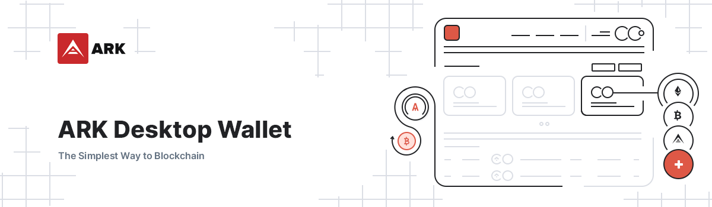

# Ark Desktop Wallet



## :confetti_ball: Initial release of the all new ARK Desktop Wallet v2 :confetti_ball:

**Note: This is a public beta release. Although the features that are present are expected to be functional and working, it’s still a work in progress and can result in unexpected behaviour. If you find any issues, please open a [GitHub issue](https://github.com/ArkEcosystem/desktop-wallet/issues/new)**

------

[](https://circleci.com/gh/ArkEcosystem/desktop-wallet)
[](https://github.com/ArkEcosystem/desktop-wallet/releases)
[](https://opensource.org/licenses/MIT)

## Download
[Latest Release](https://github.com/ArkEcosystem/ark-desktop/releases)

## Development

### Requirements

#### Ubuntu
In Ubuntu the development files of `libudev` are necessary:
```
sudo apt-get install libudev-dev libusb-1.0-0-dev
```

#### Windows
- Python 2.7
- Visual Studio 2017

#### Node 9
There are certain packages (such as the ledger HID packages) which do not work on Node 10.

To download Node 9, head over to [here](https://nodejs.org/en/blog/release/v9.11.1/)

#### Yarn
Install the Yarn dependency manager
```
npm install -g yarn
```

### Commands

``` bash
# Install dependencies
yarn install

# Serve the application with hot reload at localhost:9080
yarn dev

# Lint all JS/Vue files in the `src` and `__tests__`
yarn lint

# Lint, and fix, all JS/Vue files in `src` and `__tests__`
yarn lint:fix

# Check that all dependencies are used
yarn depcheck

# Collect the code and produce a compressed file
yarn pack

# Build electron application for production (Current OS)
yarn build

# Build electron application for production (Windows)
yarn build:win

# Build electron application for production (Mac)
yarn build:mac

# Build electron application for production (Linux)
yarn build:linux

# Run unit and end-to-end tests
yarn test

# Run unit tests
yarn test:unit

# Run unit tests and generate and display the coverage report
yarn test:unit:coverage

# Run unit tests and watch for changes to re-run the tests
yarn test:unit:watch

# Run end-to-end tests, without building the application
yarn test:e2e

# Build the application and run end-to-end tests
yarn test:e2e:build
```

## Security

If you discover a security vulnerability within this project, please send an e-mail to security@ark.io. All security vulnerabilities will be promptly addressed.

## Credits

 - [Alex Barnsley](https://github.com/alexbarnsley)
 - [ItsANameToo](https://github.com/ItsANameToo)
 - [Juan A. Martín](https://github.com/j-a-m-l)
 - [Lúcio Rubens](https://github.com/luciorubeens)
 - [Mario Vega](https://github.com/mvega3)
 - [All Contributors](../../contributors)

## License

[MIT](LICENSE) © [ArkEcosystem](https://ark.io)
